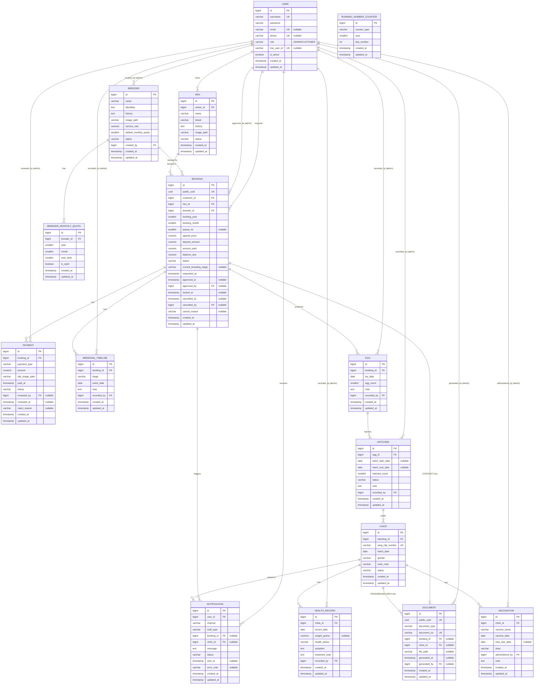

# STEP 1 — System Analysis & Database Design
## ระบบจัดการการฝากผสมไก่ชน (Gamecock Breeding Management System)

**Source of Truth ที่ใช้:**
- `DFD_L.0minipro.drawio.pdf` (Context Diagram)
- `DFD_L.1.drawio.pdf` (Level 1 — 9 Process / 11 Data Store)
- `บทที่1.pdf` (บทนำ, วัตถุประสงค์, ขอบเขตระบบงาน 1.3.2.1–1.3.2.20, เครื่องมือที่ใช้)

**สถานะโปรเจกต์ก่อนเริ่มงาน:** repository ว่างเปล่า ไม่มี code, migration, หรือ database เดิม — จึงไม่มีความเสี่ยงเรื่อง backward compatibility ใน STEP นี้ (ตรวจสอบแล้วตาม Global Rule ข้อ 1, 2, 3)

**Tech stack ที่ระบุใน บทที่ 1:** PostgreSQL / Python 3.14 / HTML5 / CSS3 / VS Code (ไม่ได้ระบุ framework ชัดเจน — สมมติฐาน: Django ตาม persona ที่กำหนด ดู §16 Assumptions)

**ขอบเขต STEP 1 (ตามที่ผู้ใช้กำหนด):** วิเคราะห์ + ออกแบบ Database เท่านั้น **ยังไม่เขียน** Frontend / API จริง / LINE integration / PDF generation — เอกสารนี้คือ Design Artifact ล้วนๆ ยังไม่มีการสร้างไฟล์ code, migration หรือรัน database จริง

---

## 0. Review Log (ตรวจสอบซ้ำ 2 รอบตามที่กำหนด)

**รอบที่ 1 — ตรวจ Relationship:** ตรวจสอบความสัมพันธ์ทั้งหมดใน §5–§6 เทียบกับ DFD data flow (ใครเขียน/อ่าน data store ไหน) และกับรายการ Relationship ที่ผู้ใช้ระบุมาในโจทย์ ผลตรวจ: relationship ทั้งหมดสอดคล้องกัน ไม่มี relationship ซ้ำซ้อนที่ไม่มีเหตุผล (รายละเอียดการตัดสินใจแต่ละจุดอยู่ใน §15 Conflict Log)

**รอบที่ 2 — ตรวจ Business Rule / Duplicate / Race Condition:** ตรวจสอบ Business Rule ทั้ง 16 ข้อใน §10 กับ Constraint จริงใน §4/§7 ว่ามี DB constraint หรือ transaction lock รองรับครบทุกข้อ ผลตรวจ: พบ 3 จุดที่ DB constraint เดี่ยวไม่พอ (ต้องพึ่ง service-layer transaction + `SELECT ... FOR UPDATE`) ได้ทำเครื่องหมายไว้ชัดเจนใน §7 และ §10 ว่า "Enforced by: Service Layer Transaction" ไม่ใช่ DB constraint ล้วน

---

## 1. Requirement Matrix

| Chapter 1 Scope (1.3.2.x) | DFD Process | Entity ที่เกี่ยวข้อง | STEP ที่จะสร้างจริง |
|---|---|---|---|
| 1.3.2.1 จัดการผู้ใช้งาน/ตรวจสอบสิทธิ์ | P1 สมัครสมาชิก, P2 ตรวจสอบสิทธิ์ | User | STEP1 (schema), STEP2 (API/Auth) |
| 1.3.2.2 จัดการข้อมูลพ่อพันธุ์ | P3 จัดการข้อมูลพื้นฐาน | Breeder | STEP1, STEP2 |
| 1.3.2.3 แสดงโควตา/คิวว่างรายเดือน | P3/P4 (ไม่มี store ชัดใน DFD — ดู Conflict Log #3) | BreederMonthlyQuota | STEP1, STEP2 |
| 1.3.2.4 บันทึกข้อมูลแม่ไก่ลูกค้า | P3 จัดการข้อมูลพื้นฐาน | Hen | STEP1, STEP2 |
| 1.3.2.5 จองคิวฝากผสม | P4 จองคิวฝากผสม | Booking | STEP1, STEP2 |
| 1.3.2.6 รับหลักฐานชำระเงิน (มัดจำ/เต็ม) | P5 แจ้งชำระเงินมัดจำ | Payment | STEP1, STEP2 |
| 1.3.2.7 ตรวจสอบ/อนุมัติการชำระเงิน | P6 ยืนยันการชำระเงิน | Payment | STEP1, STEP2 |
| 1.3.2.8 ล็อกคิวหลังอนุมัติ | P6 | Booking (queue_no) | STEP1, STEP2 |
| 1.3.2.9 สร้างใบรับฝากผสม/ข้อตกลง | P6 | Document (type=CONTRACT) | STEP1, STEP4 (PDF จริง) |
| 1.3.2.10 บันทึกสถานะแม่ไก่ (รับเข้า/เข้าคู่/ออกไข่/ย้ายตู้ฟัก) | P7 บันทึกไทม์ไลน์ฯ | BreedingTimeline | STEP1, STEP2 |
| 1.3.2.11 แจ้งเตือนผ่าน LINE | (ทุก process ที่มี "อัพเดตสถานะ") | Notification | STEP1 (schema), STEP3 (LINE จริง) |
| 1.3.2.12 บันทึกการฟัก/จำนวนไข่/อัตราฟัก/อัตรารอด | P7 | Egg, Hatching | STEP1, STEP2 |
| 1.3.2.13 บันทึกการเจริญเติบโต/ให้ยา/วัคซีน | P7(สุขภาพ) บันทึกสุขภาพและการอนุบาลไก่ | HealthRecord, Vaccination | STEP1, STEP2 |
| 1.3.2.14 แสดงไทม์ไลน์สุขภาพดิจิทัล | P9 รายงาน | HealthRecord, Vaccination (read) | STEP2 |
| 1.3.2.15 คำนวณยอดค้างชำระ/ตรวจงวดสุดท้าย | P8 | Booking (balance_due), Payment | STEP1, STEP2 |
| 1.3.2.16 สร้างเลขกิ๊ปติดปีกอัตโนมัติ ป้องกันเลขซ้ำ | P8 รันเลขกิ๊บ... | Chick.wing_clip_number, RunningNumberCounter | STEP1, STEP2 |
| 1.3.2.17 ใบรับรองสายพันธุ์ (Pedigree, PDF) | P8 | Document (type=PEDIGREE_CERTIFICATE) | STEP1, STEP4 |
| 1.3.2.18 ส่งเอกสาร/ข้อมูลส่งมอบผ่าน LINE | P8 | Document (type=DELIVERY_HISTORY), Notification | STEP1, STEP3/4 |
| 1.3.2.19 ค้นหา/เรียกดูประวัติย้อนหลัง | P9 รายงาน | ทุก entity (read + index) | STEP2 |
| 1.3.2.20 จัดทำรายงานบริหารจัดการ | P9 รายงาน | Booking, Payment, Egg, Hatching, Chick (aggregate) | STEP2 |

---

## 2. Entity List (15 Tables)

| # | Entity | เหตุผลที่มี | มาจาก Requirement |
|---|---|---|---|
| 1 | User | ผู้ใช้งานระบบ 2 บทบาท (Admin/Customer) — ตามโจทย์ระบุตรง | 1.3.1, 1.3.2.1 |
| 2 | Breeder | ข้อมูลพ่อพันธุ์ — ตามโจทย์ระบุตรง | 1.3.2.2 |
| 3 | BreederMonthlyQuota | **เพิ่มเอง** — DFD ไม่มี data store สำหรับโควตา แต่ 1.3.2.3 ต้องการแสดงโควตา/คิวว่าง "รายเดือน" ซึ่งต้องมีค่ากำหนดสูงสุดต่อเดือนต่อพ่อพันธุ์ที่ query ได้เร็วและแก้ไขได้ทีละเดือน | 1.3.2.3 |
| 4 | Hen | ข้อมูลแม่ไก่ลูกค้า — ตามโจทย์ระบุตรง | 1.3.2.4 |
| 5 | Booking | การจองคิวฝากผสม — ตามโจทย์ระบุตรง | 1.3.2.5–1.3.2.9, 1.3.2.15 |
| 6 | Payment | การชำระเงิน (มัดจำ/เต็ม/เพิ่มเติม) — ตามโจทย์ระบุตรง | 1.3.2.6, 1.3.2.7, 1.3.2.15 |
| 7 | BreedingTimeline | ไทม์ไลน์สถานะแม่ไก่/การผสม (event log ไม่ใช่ field เดียว เพื่อรองรับ 1.3.2.19 ค้นประวัติย้อนหลัง) | 1.3.2.10 |
| 8 | Egg | ข้อมูลการออกไข่ — แยกจาก Hatching เพราะโจทย์ผู้ใช้ระบุ Entity แยกกันชัดเจน (ดู Conflict Log #2) | 1.3.2.10, 1.3.2.12 |
| 9 | Hatching | ข้อมูลการฟัก (อัตราฟัก/อัตรารอด) — แยกจาก Egg | 1.3.2.12 |
| 10 | Chick | ลูกไก่รายตัว พร้อมเลขกิ๊ปติดปีก | 1.3.2.13, 1.3.2.16 |
| 11 | HealthRecord | ประวัติสุขภาพลูกไก่ | 1.3.2.13, 1.3.2.14 |
| 12 | Vaccination | ประวัติวัคซีนลูกไก่ | 1.3.2.13, 1.3.2.14 |
| 13 | Document | เอกสาร 3 ประเภท (สัญญา/ใบรับรองสายพันธุ์/ใบส่งมอบ) รวมเป็นตารางเดียวแบบมี `document_type` แทนที่จะแยก 3 ตาราง — เหตุผลดู Conflict Log #4 | 1.3.2.9, 1.3.2.17, 1.3.2.18 |
| 14 | Notification | log การแจ้งเตือนผ่าน LINE (เก็บ schema ไว้ก่อน ยังไม่ต่อ LINE API จริงใน STEP นี้) | 1.3.2.11, 1.3.2.18 |
| 15 | RunningNumberCounter | **เพิ่มเอง** — กลไกกลางป้องกัน race condition สำหรับเลขรันทุกประเภท (เลขกิ๊ปติดปีก, queue_no, เลขที่เอกสาร) ตาม Global Rule ข้อ 18–19 ที่บังคับว่าการสร้าง Running Number ต้องป้องกัน race condition | 1.3.2.16, Global Rule #18/19 |

**ไม่สร้าง** ตาราง `Role`/`Permission` แยก เพราะระบบมีแค่ 2 บทบาทคงที่ (Admin/Customer) — ใช้ field `role` ใน User พอ ไม่ over-engineer

**ไม่สร้าง** ตาราง `BreederImage`/`HenImage` แยกใน STEP นี้ — ใช้ field `image_path` เดี่ยวก่อน (ถ้าต้อง gallery หลายรูปในอนาคตค่อยแตกตารางใน STEP ถัดไป เพราะยังไม่มี requirement ยืนยันว่าต้องมีหลายรูป)

---

## 3. ER Diagram (Mermaid)



---

## 4. Database Schema (Field-Level)

> ทุกตารางมี `id BIGINT PK` (BigAutoField, ตาม Global Rule #8 — ไม่ใช้ UUID เป็น PK) และมี `created_at`/`updated_at` ตาม Global Rule #10
> `public_uuid` บน `Booking` และ `Document` เป็น field เสริม (ไม่ใช่ PK) เพื่อใช้เป็น external reference ใน URL แทน sequential id — ป้องกัน ID enumeration/IDOR (Global Rule #12) โดยไม่ขัด Global Rule #8

### 4.1 User
| Field | Type | PK | FK | Nullable | Default | Unique | Index | Constraint |
|---|---|---|---|---|---|---|---|---|
| id | BIGINT | ✅ | | ❌ | auto | ✅ | ✅ | |
| username | VARCHAR(150) | | | ❌ | | ✅ | ✅ | |
| password | VARCHAR(128) | | | ❌ | | | | hashed (Django) |
| email | VARCHAR(254) | | | ✅ | NULL | ✅ | ✅ | |
| phone | VARCHAR(20) | | | ✅ | NULL | ✅ | ✅ | |
| role | VARCHAR(10) | | | ❌ | 'CUSTOMER' | | ✅ | CHECK IN ('ADMIN','CUSTOMER') |
| line_user_id | VARCHAR(64) | | | ✅ | NULL | ✅ | ✅ | สำหรับ STEP3 LINE integration |
| is_active | BOOLEAN | | | ❌ | TRUE | | | |
| created_at | TIMESTAMP | | | ❌ | now() | | | |
| updated_at | TIMESTAMP | | | ❌ | now() | | | auto-update |

### 4.2 Breeder
| Field | Type | PK | FK | Nullable | Default | Unique | Index | Constraint |
|---|---|---|---|---|---|---|---|---|
| id | BIGINT | ✅ | | ❌ | auto | ✅ | ✅ | |
| name | VARCHAR(150) | | | ❌ | | | ✅ | |
| bloodline | TEXT | | | ✅ | NULL | | | |
| history | TEXT | | | ✅ | NULL | | | |
| image_path | VARCHAR(255) | | | ✅ | NULL | | | |
| service_rate | NUMERIC(10,2) | | | ❌ | 0 | | | CHECK ≥ 0 |
| default_monthly_quota | SMALLINT | | | ❌ | 0 | | | CHECK ≥ 0 |
| status | VARCHAR(10) | | | ❌ | 'ACTIVE' | | ✅ | CHECK IN ('ACTIVE','INACTIVE','RETIRED') |
| created_by | BIGINT | | User.id | ✅ | NULL | | ✅ | ON DELETE SET NULL |
| created_at | TIMESTAMP | | | ❌ | now() | | | |
| updated_at | TIMESTAMP | | | ❌ | now() | | | |

### 4.3 BreederMonthlyQuota
| Field | Type | PK | FK | Nullable | Default | Unique | Index | Constraint |
|---|---|---|---|---|---|---|---|---|
| id | BIGINT | ✅ | | ❌ | auto | ✅ | ✅ | |
| breeder_id | BIGINT | | Breeder.id | ❌ | | | ✅ | ON DELETE CASCADE |
| year | SMALLINT | | | ❌ | | | | CHECK ≥ 2000 |
| month | SMALLINT | | | ❌ | | | | CHECK BETWEEN 1 AND 12 |
| max_slots | SMALLINT | | | ❌ | 0 | | | CHECK ≥ 0 |
| is_open | BOOLEAN | | | ❌ | TRUE | | | |
| created_at | TIMESTAMP | | | ❌ | now() | | | |
| updated_at | TIMESTAMP | | | ❌ | now() | | | |
| **composite** | | | | | | ✅ UNIQUE(breeder_id, year, month) | ✅ | |

### 4.4 Hen
| Field | Type | PK | FK | Nullable | Default | Unique | Index | Constraint |
|---|---|---|---|---|---|---|---|---|
| id | BIGINT | ✅ | | ❌ | auto | ✅ | ✅ | |
| owner_id | BIGINT | | User.id | ❌ | | | ✅ | ON DELETE RESTRICT (ห้ามลบ user ที่มีแม่ไก่ผูกอยู่) |
| name | VARCHAR(150) | | | ❌ | | | ✅ | |
| breed | VARCHAR(150) | | | ✅ | NULL | | | |
| history | TEXT | | | ✅ | NULL | | | |
| image_path | VARCHAR(255) | | | ✅ | NULL | | | |
| status | VARCHAR(10) | | | ❌ | 'ACTIVE' | | ✅ | CHECK IN ('ACTIVE','INACTIVE') |
| created_at | TIMESTAMP | | | ❌ | now() | | | |
| updated_at | TIMESTAMP | | | ❌ | now() | | | |

### 4.5 Booking
| Field | Type | PK | FK | Nullable | Default | Unique | Index | Constraint |
|---|---|---|---|---|---|---|---|---|
| id | BIGINT | ✅ | | ❌ | auto | ✅ | ✅ | |
| public_uuid | UUID | | | ❌ | gen_random_uuid() | ✅ | ✅ | |
| customer_id | BIGINT | | User.id | ❌ | | | ✅ | ON DELETE RESTRICT |
| hen_id | BIGINT | | Hen.id | ❌ | | | ✅ | ON DELETE RESTRICT |
| breeder_id | BIGINT | | Breeder.id | ❌ | | | ✅ | ON DELETE RESTRICT |
| booking_year | SMALLINT | | | ❌ | | | ✅(composite) | |
| booking_month | SMALLINT | | | ❌ | | | ✅(composite) | CHECK BETWEEN 1 AND 12 |
| queue_no | SMALLINT | | | ✅ | NULL | | | assigned ตอน APPROVED_LOCKED เท่านั้น |
| agreed_price | NUMERIC(10,2) | | | ❌ | | | | snapshot จาก Breeder.service_rate ตอนจอง |
| deposit_amount | NUMERIC(10,2) | | | ❌ | 0 | | | CHECK 0 ≤ deposit_amount ≤ agreed_price |
| amount_paid | NUMERIC(10,2) | | | ❌ | 0 | | | CHECK ≥ 0, cache, sync จาก Payment ที่ APPROVED |
| balance_due | NUMERIC(10,2) | | | ❌ | 0 | | | CHECK ≥ 0, cache = agreed_price - amount_paid |
| status | VARCHAR(20) | | | ❌ | 'PENDING_PAYMENT' | | ✅ | CHECK IN (7 ค่า ดู §9) |
| current_breeding_stage | VARCHAR(20) | | | ✅ | NULL | | | cache จาก BreedingTimeline ล่าสุด |
| requested_at | TIMESTAMP | | | ❌ | now() | | | |
| approved_at | TIMESTAMP | | | ✅ | NULL | | | |
| approved_by | BIGINT | | User.id | ✅ | NULL | | ✅ | ON DELETE SET NULL |
| locked_at | TIMESTAMP | | | ✅ | NULL | | | |
| cancelled_at | TIMESTAMP | | | ✅ | NULL | | | |
| cancelled_by | BIGINT | | User.id | ✅ | NULL | | | ON DELETE SET NULL |
| cancel_reason | VARCHAR(255) | | | ✅ | NULL | | | |
| created_at | TIMESTAMP | | | ❌ | now() | | | |
| updated_at | TIMESTAMP | | | ❌ | now() | | | |

**Partial Unique Constraints (ป้องกัน duplicate/double-booking — ดู §7, §10):**
- `uq_booking_hen_active` — UNIQUE(hen_id) WHERE status IN ('PENDING_PAYMENT','WAITING_APPROVAL','APPROVED_LOCKED','IN_PROGRESS')
- `uq_booking_no_duplicate_request` — UNIQUE(hen_id, breeder_id, booking_year, booking_month) WHERE status NOT IN ('CANCELLED','REJECTED')
- `uq_booking_queue_slot` — UNIQUE(breeder_id, booking_year, booking_month, queue_no) WHERE queue_no IS NOT NULL

### 4.6 Payment
| Field | Type | PK | FK | Nullable | Default | Unique | Index | Constraint |
|---|---|---|---|---|---|---|---|---|
| id | BIGINT | ✅ | | ❌ | auto | ✅ | ✅ | |
| booking_id | BIGINT | | Booking.id | ❌ | | | ✅ | ON DELETE CASCADE |
| payment_type | VARCHAR(12) | | | ❌ | | | ✅(composite) | CHECK IN ('DEPOSIT','FULL','ADDITIONAL') |
| amount | NUMERIC(10,2) | | | ❌ | | | | CHECK > 0 |
| slip_image_path | VARCHAR(255) | | | ❌ | | | | |
| paid_at | TIMESTAMP | | | ❌ | | | | ประกาศโดยลูกค้า |
| status | VARCHAR(15) | | | ❌ | 'PENDING_REVIEW' | | ✅ | CHECK IN ('PENDING_REVIEW','APPROVED','REJECTED') |
| reviewed_by | BIGINT | | User.id | ✅ | NULL | | | ON DELETE SET NULL |
| reviewed_at | TIMESTAMP | | | ✅ | NULL | | | |
| reject_reason | VARCHAR(255) | | | ✅ | NULL | | | |
| created_at | TIMESTAMP | | | ❌ | now() | | | |
| updated_at | TIMESTAMP | | | ❌ | now() | | | |

**Partial Unique:** `uq_payment_pending_type` — UNIQUE(booking_id, payment_type) WHERE status = 'PENDING_REVIEW' (ป้องกันแจ้งชำระเงินซ้ำประเภทเดียวกันค้างพร้อมกัน)

### 4.7 BreedingTimeline
| Field | Type | PK | FK | Nullable | Default | Unique | Index | Constraint |
|---|---|---|---|---|---|---|---|---|
| id | BIGINT | ✅ | | ❌ | auto | ✅ | ✅ | |
| booking_id | BIGINT | | Booking.id | ❌ | | | ✅ | ON DELETE CASCADE |
| stage | VARCHAR(20) | | | ❌ | | ✅(composite) | | CHECK IN ('RECEIVED_AT_FARM','PAIRED','EGG_LAYING','MOVED_TO_INCUBATOR','COMPLETED') |
| event_date | DATE | | | ❌ | | | | |
| note | TEXT | | | ✅ | NULL | | | |
| recorded_by | BIGINT | | User.id | ❌ | | | | ON DELETE RESTRICT |
| created_at | TIMESTAMP | | | ❌ | now() | | | |
| updated_at | TIMESTAMP | | | ❌ | now() | | | |

**Unique:** UNIQUE(booking_id, stage) — แต่ละ stage เกิดได้ครั้งเดียวต่อ booking (แก้ไขด้วย UPDATE ไม่ใช่ insert ซ้ำ)

### 4.8 Egg
| Field | Type | PK | FK | Nullable | Default | Unique | Index | Constraint |
|---|---|---|---|---|---|---|---|---|
| id | BIGINT | ✅ | | ❌ | auto | ✅ | ✅ | |
| booking_id | BIGINT | | Booking.id | ❌ | | | ✅ | ON DELETE CASCADE |
| lay_date | DATE | | | ❌ | | | | |
| egg_count | SMALLINT | | | ❌ | | | | CHECK ≥ 0 |
| note | TEXT | | | ✅ | NULL | | | |
| recorded_by | BIGINT | | User.id | ❌ | | | | ON DELETE RESTRICT |
| created_at | TIMESTAMP | | | ❌ | now() | | | |
| updated_at | TIMESTAMP | | | ❌ | now() | | | |

### 4.9 Hatching
| Field | Type | PK | FK | Nullable | Default | Unique | Index | Constraint |
|---|---|---|---|---|---|---|---|---|
| id | BIGINT | ✅ | | ❌ | auto | ✅ | ✅ | |
| egg_id | BIGINT | | Egg.id | ❌ | | | ✅ | ON DELETE CASCADE |
| hatch_start_date | DATE | | | ✅ | NULL | | | |
| hatch_end_date | DATE | | | ✅ | NULL | | | |
| hatched_count | SMALLINT | | | ❌ | 0 | | | CHECK ≥ 0; ต้อง ≤ Egg.egg_count (Enforced by: Service Layer — cross-row, ทำเป็น DB CHECK ตรงไม่ได้) |
| status | VARCHAR(12) | | | ❌ | 'INCUBATING' | | ✅ | CHECK IN ('INCUBATING','HATCHED','FAILED') |
| note | TEXT | | | ✅ | NULL | | | |
| recorded_by | BIGINT | | User.id | ❌ | | | | ON DELETE RESTRICT |
| created_at | TIMESTAMP | | | ❌ | now() | | | |
| updated_at | TIMESTAMP | | | ❌ | now() | | | |

### 4.10 Chick
| Field | Type | PK | FK | Nullable | Default | Unique | Index | Constraint |
|---|---|---|---|---|---|---|---|---|
| id | BIGINT | ✅ | | ❌ | auto | ✅ | ✅ | |
| hatching_id | BIGINT | | Hatching.id | ❌ | | | ✅ | ON DELETE RESTRICT |
| wing_clip_number | VARCHAR(20) | | | ❌ | | ✅ | ✅ | generate ผ่าน RunningNumberCounter เท่านั้น (§10 Rule 14) |
| hatch_date | DATE | | | ❌ | | | | |
| gender | VARCHAR(10) | | | ❌ | 'UNKNOWN' | | | CHECK IN ('MALE','FEMALE','UNKNOWN') |
| color_note | VARCHAR(255) | | | ✅ | NULL | | | |
| status | VARCHAR(12) | | | ❌ | 'ALIVE' | | ✅ | CHECK IN ('ALIVE','DECEASED','DELIVERED') |
| created_at | TIMESTAMP | | | ❌ | now() | | | |
| updated_at | TIMESTAMP | | | ❌ | now() | | | |

### 4.11 HealthRecord
| Field | Type | PK | FK | Nullable | Default | Unique | Index | Constraint |
|---|---|---|---|---|---|---|---|---|
| id | BIGINT | ✅ | | ❌ | auto | ✅ | ✅ | |
| chick_id | BIGINT | | Chick.id | ❌ | | | ✅ | ON DELETE CASCADE |
| record_date | DATE | | | ❌ | | | | |
| weight_grams | NUMERIC(6,1) | | | ✅ | NULL | | | CHECK ≥ 0 |
| health_status | VARCHAR(50) | | | ✅ | NULL | | | |
| symptom | TEXT | | | ✅ | NULL | | | |
| treatment_note | TEXT | | | ✅ | NULL | | | |
| recorded_by | BIGINT | | User.id | ❌ | | | | ON DELETE RESTRICT |
| created_at | TIMESTAMP | | | ❌ | now() | | | |
| updated_at | TIMESTAMP | | | ❌ | now() | | | |

### 4.12 Vaccination
| Field | Type | PK | FK | Nullable | Default | Unique | Index | Constraint |
|---|---|---|---|---|---|---|---|---|
| id | BIGINT | ✅ | | ❌ | auto | ✅ | ✅ | |
| chick_id | BIGINT | | Chick.id | ❌ | | | ✅ | ON DELETE CASCADE |
| vaccine_name | VARCHAR(150) | | | ❌ | | | | |
| vaccine_date | DATE | | | ❌ | | | | |
| next_due_date | DATE | | | ✅ | NULL | | | |
| dose | VARCHAR(50) | | | ✅ | NULL | | | |
| administered_by | BIGINT | | User.id | ❌ | | | | ON DELETE RESTRICT |
| note | TEXT | | | ✅ | NULL | | | |
| created_at | TIMESTAMP | | | ❌ | now() | | | |
| updated_at | TIMESTAMP | | | ❌ | now() | | | |

### 4.13 Document
| Field | Type | PK | FK | Nullable | Default | Unique | Index | Constraint |
|---|---|---|---|---|---|---|---|---|
| id | BIGINT | ✅ | | ❌ | auto | ✅ | ✅ | |
| public_uuid | UUID | | | ❌ | gen_random_uuid() | ✅ | ✅ | |
| document_type | VARCHAR(20) | | | ❌ | | | ✅ | CHECK IN ('CONTRACT','PEDIGREE_CERTIFICATE','DELIVERY_HISTORY') |
| document_no | VARCHAR(30) | | | ❌ | | ✅ | ✅ | generate ผ่าน RunningNumberCounter |
| booking_id | BIGINT | | Booking.id | ✅ | NULL | | ✅ | ON DELETE CASCADE |
| chick_id | BIGINT | | Chick.id | ✅ | NULL | | ✅ | ON DELETE CASCADE |
| file_path | VARCHAR(255) | | | ✅ | NULL | | | เติมค่าจริงใน STEP4 (PDF) |
| generated_at | TIMESTAMP | | | ✅ | NULL | | | |
| generated_by | BIGINT | | User.id | ✅ | NULL | | | ON DELETE SET NULL |
| created_at | TIMESTAMP | | | ❌ | now() | | | |
| updated_at | TIMESTAMP | | | ❌ | now() | | | |

**CHECK (Data Ownership — §10 Rule 16):**
`(document_type = 'CONTRACT' AND booking_id IS NOT NULL AND chick_id IS NULL) OR (document_type IN ('PEDIGREE_CERTIFICATE','DELIVERY_HISTORY') AND chick_id IS NOT NULL)`

### 4.14 Notification
| Field | Type | PK | FK | Nullable | Default | Unique | Index | Constraint |
|---|---|---|---|---|---|---|---|---|
| id | BIGINT | ✅ | | ❌ | auto | ✅ | ✅ | |
| user_id | BIGINT | | User.id | ❌ | | | ✅ | ON DELETE CASCADE |
| channel | VARCHAR(10) | | | ❌ | 'LINE' | | | |
| notif_type | VARCHAR(30) | | | ❌ | | | ✅ | |
| booking_id | BIGINT | | Booking.id | ✅ | NULL | | ✅ | ON DELETE CASCADE |
| chick_id | BIGINT | | Chick.id | ✅ | NULL | | ✅ | ON DELETE CASCADE |
| message | TEXT | | | ❌ | | | | |
| status | VARCHAR(10) | | | ❌ | 'PENDING' | | ✅ | CHECK IN ('PENDING','SENT','FAILED') |
| sent_at | TIMESTAMP | | | ✅ | NULL | | | |
| error_note | VARCHAR(255) | | | ✅ | NULL | | | |
| created_at | TIMESTAMP | | | ❌ | now() | | | |
| updated_at | TIMESTAMP | | | ❌ | now() | | | |

### 4.15 RunningNumberCounter
| Field | Type | PK | FK | Nullable | Default | Unique | Index | Constraint |
|---|---|---|---|---|---|---|---|---|
| id | BIGINT | ✅ | | ❌ | auto | ✅ | ✅ | |
| counter_type | VARCHAR(20) | | | ❌ | | | ✅(composite) | CHECK IN ('WING_CLIP','BOOKING_QUEUE','CONTRACT_NO','PEDIGREE_NO') |
| year | SMALLINT | | | ❌ | | | ✅(composite) | |
| last_number | INT | | | ❌ | 0 | | | CHECK ≥ 0 |
| created_at | TIMESTAMP | | | ❌ | now() | | | |
| updated_at | TIMESTAMP | | | ❌ | now() | | | |

**Unique:** UNIQUE(counter_type, year) — แถวนี้จะถูก `SELECT ... FOR UPDATE` ในทุก transaction ที่ต้อง generate เลขรัน (ดู §10 Rule 14)

---

## 5. Relationship Matrix

| From | To | Type | FK Location | หมายเหตุ |
|---|---|---|---|---|
| User | Hen | 1:N | Hen.owner_id | ลูกค้า 1 คนมีแม่ไก่ได้หลายตัว |
| User | Booking | 1:N | Booking.customer_id | |
| User | Booking | 1:N | Booking.approved_by (admin) | |
| User | Payment | 1:N | Payment.reviewed_by (admin) | |
| User | Breeder | 1:N | Breeder.created_by (admin) | |
| User | Notification | 1:N | Notification.user_id | |
| Breeder | Booking | 1:N | Booking.breeder_id | |
| Breeder | BreederMonthlyQuota | 1:N | BreederMonthlyQuota.breeder_id | |
| Hen | Booking | 1:N (ธุรกิจ: active ได้แค่ 1) | Booking.hen_id | จำกัดด้วย partial unique index |
| Booking | Payment | 1:N | Payment.booking_id | |
| Booking | BreedingTimeline | 1:N | BreedingTimeline.booking_id | event log |
| Booking | Egg | 1:N | Egg.booking_id | |
| Booking | Document | 1:1 (เชิงธุรกิจ) | Document.booking_id (nullable) | เฉพาะ type=CONTRACT |
| Booking | Notification | 1:N | Notification.booking_id (nullable) | |
| Egg | Hatching | 1:N (ปกติ 1:1) | Hatching.egg_id | รองรับกรณีบันทึกแก้ไข/หลายรอบฟัก |
| Hatching | Chick | 1:N | Chick.hatching_id | |
| Chick | HealthRecord | 1:N | HealthRecord.chick_id | |
| Chick | Vaccination | 1:N | Vaccination.chick_id | |
| Chick | Document | 1:N | Document.chick_id (nullable) | type=PEDIGREE_CERTIFICATE/DELIVERY_HISTORY |
| Chick | Notification | 1:N | Notification.chick_id (nullable) | |

ไม่มี relationship ซ้ำซ้อน — ทุกเส้นตรงกับ requirement ที่ผู้ใช้ระบุใน RELATIONSHIP section ของโจทย์ ยกเว้นที่เพิ่มเอง (Breeder→BreederMonthlyQuota, ตัวแปร admin FK ต่างๆ) ซึ่งจำเป็นสำหรับ audit/accountability ตาม Global Rule

---

## 6. Foreign Key Matrix

| Table | Column | References | On Delete |
|---|---|---|---|
| Breeder | created_by | User.id | SET NULL |
| BreederMonthlyQuota | breeder_id | Breeder.id | CASCADE |
| Hen | owner_id | User.id | RESTRICT |
| Booking | customer_id | User.id | RESTRICT |
| Booking | hen_id | Hen.id | RESTRICT |
| Booking | breeder_id | Breeder.id | RESTRICT |
| Booking | approved_by | User.id | SET NULL |
| Booking | cancelled_by | User.id | SET NULL |
| Payment | booking_id | Booking.id | CASCADE |
| Payment | reviewed_by | User.id | SET NULL |
| BreedingTimeline | booking_id | Booking.id | CASCADE |
| BreedingTimeline | recorded_by | User.id | RESTRICT |
| Egg | booking_id | Booking.id | CASCADE |
| Egg | recorded_by | User.id | RESTRICT |
| Hatching | egg_id | Egg.id | CASCADE |
| Hatching | recorded_by | User.id | RESTRICT |
| Chick | hatching_id | Hatching.id | RESTRICT |
| HealthRecord | chick_id | Chick.id | CASCADE |
| HealthRecord | recorded_by | User.id | RESTRICT |
| Vaccination | chick_id | Chick.id | CASCADE |
| Vaccination | administered_by | User.id | RESTRICT |
| Document | booking_id | Booking.id | CASCADE |
| Document | chick_id | Chick.id | CASCADE |
| Document | generated_by | User.id | SET NULL |
| Notification | user_id | User.id | CASCADE |
| Notification | booking_id | Booking.id | CASCADE |
| Notification | chick_id | Chick.id | CASCADE |

**หลักการเลือก ON DELETE:**
- `RESTRICT` — ใช้กับข้อมูลที่เป็น "ต้นทางของธุรกรรมทางการเงิน/ความเป็นเจ้าของ" (Hen, Booking→customer/hen/breeder, Chick←Hatching) ป้องกันการลบ record ที่ยังมีประวัติผูกอยู่โดยไม่ตั้งใจ ต้อง soft-delete/เปลี่ยน status แทน
- `CASCADE` — ใช้กับข้อมูลลูกที่ "ไม่มีความหมายถ้าพ่อแม่หายไป" (Payment, BreedingTimeline, Egg, HealthRecord, Vaccination, Document, Notification)
- `SET NULL` — ใช้กับ field ที่เป็นแค่ "ผู้กระทำ" (audit reference) ไม่ใช่ความเป็นเจ้าของข้อมูลจริง (created_by, approved_by, reviewed_by, generated_by, cancelled_by)

---

## 7. Constraint Matrix

| Constraint | Table | ชนิด | Enforced by |
|---|---|---|---|
| role IN ('ADMIN','CUSTOMER') | User | CHECK | DB |
| username/email/phone/line_user_id UNIQUE | User | UNIQUE | DB |
| service_rate ≥ 0, default_monthly_quota ≥ 0 | Breeder | CHECK | DB |
| status IN (...) | Breeder | CHECK | DB |
| UNIQUE(breeder_id, year, month) | BreederMonthlyQuota | UNIQUE | DB |
| max_slots ≥ 0 | BreederMonthlyQuota | CHECK | DB |
| status IN ('ACTIVE','INACTIVE') | Hen | CHECK | DB |
| status IN (7 ค่า) | Booking | CHECK | DB |
| booking_month BETWEEN 1 AND 12 | Booking | CHECK | DB |
| deposit_amount ≤ agreed_price | Booking | CHECK | DB |
| amount_paid ≥ 0, balance_due ≥ 0 | Booking | CHECK | DB |
| **uq_booking_hen_active** (แม่ไก่ถูกจองซ้อนไม่ได้) | Booking | Partial UNIQUE INDEX | DB |
| **uq_booking_no_duplicate_request** (จองซ้ำ) | Booking | Partial UNIQUE INDEX | DB |
| **uq_booking_queue_slot** (คิวชนกัน) | Booking | Partial UNIQUE INDEX | DB |
| **Breeder Queue เต็ม** (นับจำนวน booking ต่อเดือน ≤ max_slots) | Booking + BreederMonthlyQuota | Aggregate check — ทำ DB constraint ตรงไม่ได้ | **Service Layer Transaction** (`SELECT ... FOR UPDATE` บน BreederMonthlyQuota แล้วนับ COUNT ก่อน INSERT) |
| payment_type IN (...), amount > 0 | Payment | CHECK | DB |
| **uq_payment_pending_type** (แจ้งชำระซ้ำ) | Payment | Partial UNIQUE INDEX | DB |
| **Payment เกิน/ต่ำกว่ายอด** | Payment vs Booking.balance_due | Cross-table — ทำ DB constraint ตรงไม่ได้ | **Service Layer Transaction** (ตรวจ amount เทียบ balance_due ก่อน APPROVE, ไม่ใช่ตอน INSERT เพราะลูกค้าแจ้งได้แต่ admin ต้องปฏิเสธถ้าไม่ตรง) |
| stage IN (5 ค่า), UNIQUE(booking_id, stage) | BreedingTimeline | CHECK + UNIQUE | DB |
| egg_count ≥ 0 | Egg | CHECK | DB |
| hatched_count ≥ 0, status IN (...) | Hatching | CHECK | DB |
| **hatched_count ≤ Egg.egg_count** | Hatching vs Egg | Cross-table | **Service Layer Transaction** |
| **wing_clip_number UNIQUE ทั้งระบบ** | Chick | UNIQUE INDEX + generation ผ่าน RunningNumberCounter | DB (unique) + **Service Layer Transaction** (`SELECT ... FOR UPDATE` บน RunningNumberCounter ตอน generate) |
| gender/status IN (...) | Chick | CHECK | DB |
| weight_grams ≥ 0 | HealthRecord | CHECK | DB |
| document_type IN (...), document_no UNIQUE | Document | CHECK + UNIQUE | DB |
| **Document ownership** (CONTRACT ต้องมี booking_id เท่านั้น, PEDIGREE/DELIVERY ต้องมี chick_id เท่านั้น) | Document | CHECK (compound) | DB |
| status IN (...) | Notification | CHECK | DB |
| UNIQUE(counter_type, year) | RunningNumberCounter | UNIQUE | DB |

---

## 8. Index Plan

| Table | Index | เหตุผล |
|---|---|---|
| User | username, email, phone, line_user_id (UNIQUE), role | login lookup, LINE webhook lookup, filter by role |
| Breeder | status, name | list/filter หน้าแสดงพ่อพันธุ์ |
| BreederMonthlyQuota | (breeder_id, year, month) UNIQUE | query โควตาต่อเดือน |
| Hen | owner_id, status | ลูกค้าดูแม่ไก่ของตัวเอง (Data Isolation) |
| Booking | customer_id, hen_id, breeder_id, status, (breeder_id, booking_year, booking_month), public_uuid (UNIQUE) | list ตาม role, ตรวจคิวว่าง, external lookup |
| Payment | booking_id, status | ตรวจ payment ค้างอนุมัติ |
| BreedingTimeline | booking_id, (booking_id, stage) UNIQUE | ประวัติย้อนหลัง 1.3.2.19 |
| Egg | booking_id | |
| Hatching | egg_id, status | |
| Chick | hatching_id, wing_clip_number (UNIQUE), status | ค้นหาด้วยเลขกิ๊ป |
| HealthRecord | chick_id, record_date | ไทม์ไลน์สุขภาพ 1.3.2.14 |
| Vaccination | chick_id, vaccine_date | |
| Document | booking_id, chick_id, document_type, document_no (UNIQUE), public_uuid (UNIQUE) | |
| Notification | user_id, status, (booking_id), (chick_id) | ส่งซ้ำ/retry queue |
| RunningNumberCounter | (counter_type, year) UNIQUE | |

---

## 9. Status State Machine

### 9.1 Booking
```
PENDING_PAYMENT → WAITING_APPROVAL → APPROVED_LOCKED → IN_PROGRESS → COMPLETED
       ↓                  ↓
   CANCELLED           REJECTED / CANCELLED
```
| Transition | ใครทำได้ | เงื่อนไข |
|---|---|---|
| (create) → PENDING_PAYMENT | Customer | Hen ไม่มี booking active อื่น, ไม่จองซ้ำเดือนเดียวกับพ่อพันธุ์เดียวกัน |
| PENDING_PAYMENT → WAITING_APPROVAL | System (auto เมื่อ Payment ถูกสร้าง) | มี Payment(status=PENDING_REVIEW) อย่างน้อย 1 รายการ |
| WAITING_APPROVAL → APPROVED_LOCKED | Admin | Payment ล่าสุด APPROVED, จำนวน booking ที่ locked ในเดือนนั้นของพ่อพันธุ์นั้น < max_slots (ล็อกด้วย transaction), ระบบ assign queue_no |
| WAITING_APPROVAL → REJECTED | Admin | Payment ถูก REJECTED และลูกค้าไม่ resubmit |
| PENDING_PAYMENT/WAITING_APPROVAL → CANCELLED | Customer หรือ Admin | ยังไม่ locked |
| APPROVED_LOCKED → IN_PROGRESS | Admin | มี BreedingTimeline แรกถูกบันทึก |
| IN_PROGRESS → COMPLETED | Admin | มี Document(type=DELIVERY_HISTORY) ถูกสร้างและ Chick ทุกตัวใน hatching นั้น status=DELIVERED |
| APPROVED_LOCKED/IN_PROGRESS → CANCELLED | Admin เท่านั้น | ต้องระบุ cancel_reason, กรณีนี้ต้อง unlock queue_no (ปลดล็อกคิวคืน) |
| **Invalid** | COMPLETED/CANCELLED/REJECTED → ใดๆ | ห้าม (terminal state) |

### 9.2 Payment
```
PENDING_REVIEW → APPROVED
PENDING_REVIEW → REJECTED
```
| Transition | ใครทำได้ | เงื่อนไข |
|---|---|---|
| (create) → PENDING_REVIEW | Customer | ไม่มี Payment(type เดียวกัน, PENDING_REVIEW) ค้างอยู่แล้ว |
| PENDING_REVIEW → APPROVED | Admin | amount ตรงกับยอดที่คาดหวัง (deposit หรือ balance_due), อัปเดต Booking.amount_paid/balance_due ใน transaction เดียวกัน |
| PENDING_REVIEW → REJECTED | Admin | ระบุ reject_reason, ลูกค้าแจ้งใหม่ได้ (สร้าง Payment แถวใหม่) |
| **Invalid** | APPROVED/REJECTED → ใดๆ | ห้ามแก้ payment ที่ตัดสินแล้ว ต้องสร้างรายการใหม่ |

### 9.3 BreedingTimeline (stage)
```
RECEIVED_AT_FARM → PAIRED → EGG_LAYING → MOVED_TO_INCUBATOR → COMPLETED
```
| Transition | ใครทำได้ | เงื่อนไข |
|---|---|---|
| ทุก transition | Admin เท่านั้น | Booking.status ต้องเป็น APPROVED_LOCKED หรือ IN_PROGRESS, บันทึกตามลำดับ (ห้ามข้ามสถานะ — ตรวจใน service layer) |
| **Invalid** | ข้ามลำดับ (เช่น RECEIVED_AT_FARM → MOVED_TO_INCUBATOR ตรงๆ) | ห้าม |

### 9.4 Hatching (status)
```
INCUBATING → HATCHED
INCUBATING → FAILED
```
| Transition | ใครทำได้ | เงื่อนไข |
|---|---|---|
| (create) → INCUBATING | Admin | ต้องมี Egg อ้างอิงอยู่ก่อน |
| INCUBATING → HATCHED | Admin | hatched_count > 0 |
| INCUBATING → FAILED | Admin | hatched_count = 0, ระบุ note |
| **Invalid** | HATCHED/FAILED → ใดๆ | ห้าม (terminal) |

### 9.5 Chick (status)
```
ALIVE → DECEASED
ALIVE → DELIVERED
```
| Transition | ใครทำได้ | เงื่อนไข |
|---|---|---|
| (create) → ALIVE | System (จาก Hatching.HATCHED) | ต้องมี wing_clip_number generate สำเร็จก่อน |
| ALIVE → DECEASED | Admin | ระบุใน HealthRecord ประกอบ |
| ALIVE → DELIVERED | Admin | ต้องมี Document(type=DELIVERY_HISTORY) ที่อ้างถึง chick นี้ |
| **Invalid** | DECEASED/DELIVERED → ใดๆ | ห้าม (terminal) |

---

## 10. Business Rule Matrix

| # | Rule | รายละเอียด | Enforced by |
|---|---|---|---|
| 1 | Booking ซ้ำ | ลูกค้าจองแม่ไก่ตัวเดียวกัน+พ่อพันธุ์เดียวกัน+เดือนเดียวกัน ซ้ำไม่ได้ (ถ้ายังไม่ CANCELLED/REJECTED) | DB: `uq_booking_no_duplicate_request` |
| 2 | Queue ซ้ำ | 2 booking ห้ามได้ queue_no เดียวกันในพ่อพันธุ์+เดือนเดียวกัน | DB: `uq_booking_queue_slot` |
| 3 | Hen ถูกจองซ้อน | แม่ไก่ 1 ตัวมี booking ที่ active (ไม่ cancel/reject/complete) ได้แค่ 1 รายการพร้อมกัน | DB: `uq_booking_hen_active` |
| 4 | Breeder Queue เต็ม | จำนวน Booking สถานะ APPROVED_LOCKED/IN_PROGRESS ของพ่อพันธุ์ในเดือนนั้น ต้อง ≤ BreederMonthlyQuota.max_slots | **Service Layer Transaction**: `SELECT ... FOR UPDATE` บนแถว BreederMonthlyQuota ก่อนนับและ approve |
| 5 | Payment ซ้ำ | ห้ามมี Payment ประเภทเดียวกันค้าง PENDING_REVIEW มากกว่า 1 รายการต่อ booking | DB: `uq_payment_pending_type` |
| 6 | Payment มากกว่ายอด | amount ของ Payment เมื่อรวมกับ amount_paid เดิม ห้ามเกิน agreed_price — ถ้าเกิน Admin ต้อง REJECTED (ไม่ auto-approve) | Service Layer (ตรวจก่อน APPROVE) |
| 7 | Payment น้อยกว่ายอด | สำหรับ payment_type=FULL/ADDITIONAL งวดสุดท้าย amount ต้อง ≥ balance_due ปัจจุบัน ไม่งั้น REJECTED หรือรับเป็น ADDITIONAL บางส่วน | Service Layer |
| 8 | Payment Approval | ต้องเป็น Admin เท่านั้น, ทำใน transaction เดียวกับการอัปเดต Booking.amount_paid/balance_due/status | Service Layer Transaction (Global Rule #18) |
| 9 | Booking Cancellation | Customer ยกเลิกได้เฉพาะก่อน APPROVED_LOCKED เท่านั้น; หลัง locked ต้อง Admin ยกเลิกและต้องคืน queue_no (set NULL) | Service Layer + State Machine §9.1 |
| 10 | Breeding Status | ต้องบันทึกตามลำดับ stage เท่านั้น ห้ามข้าม | Service Layer + DB UNIQUE(booking_id, stage) |
| 11 | Egg Validation | egg_count ≥ 0, lay_date ต้องอยู่หลัง Booking.locked_at | DB CHECK (egg_count) + Service Layer (date logic) |
| 12 | Hatching Validation | hatched_count ≤ Egg.egg_count ที่อ้างอิง | Service Layer Transaction |
| 13 | Chick Creation | สร้างได้เฉพาะเมื่อ Hatching.status='HATCHED' และต้อง generate wing_clip_number ผ่าน RunningNumberCounter ในธุรกรรมเดียวกัน | Service Layer Transaction |
| 14 | Wing Clip Duplicate | เลขกิ๊ปต้องไม่ซ้ำทั้งระบบ — generate จาก `RunningNumberCounter(counter_type='WING_CLIP', year)` ด้วย `SELECT ... FOR UPDATE` แล้ว increment ก่อน INSERT Chick ใน transaction เดียว | DB UNIQUE(wing_clip_number) + Service Layer Transaction (Global Rule #19) |
| 15 | Customer Data Isolation | Customer เห็น/แก้ไขได้เฉพาะ Hen, Booking, Payment, Document, Notification ที่เป็นของตัวเอง (owner_id/customer_id = request.user.id เท่านั้น ไม่รับ id จาก client) | Permission Layer (Global Rule #11–13) — ดู §12 |
| 16 | Document Ownership | Document ประเภท CONTRACT ผูกกับ booking_id เท่านั้น, PEDIGREE_CERTIFICATE/DELIVERY_HISTORY ผูกกับ chick_id เท่านั้น ห้ามข้ามประเภท | DB CHECK compound constraint |

---

## 11. Error Case Matrix

| Error Case | HTTP Status (แผนสำหรับ STEP2) | Error Code (แนวทาง) | สาเหตุ |
|---|---|---|---|
| จองแม่ไก่ที่มี booking active อยู่แล้ว | 409 Conflict | `HEN_ALREADY_BOOKED` | ชน `uq_booking_hen_active` |
| จองซ้ำ (แม่ไก่+พ่อพันธุ์+เดือนเดียวกัน) | 409 Conflict | `DUPLICATE_BOOKING` | ชน `uq_booking_no_duplicate_request` |
| คิวเต็มในเดือนนั้น | 409 Conflict | `QUEUE_FULL` | count ≥ max_slots |
| แจ้งชำระเงินซ้ำประเภทเดียวกัน ขณะที่รอบเดิมยังไม่ตัดสิน | 409 Conflict | `PAYMENT_PENDING_EXISTS` | ชน `uq_payment_pending_type` |
| ยอดชำระเกินยอดที่ต้องจ่าย | 422 Unprocessable Entity | `PAYMENT_AMOUNT_EXCEEDS_BALANCE` | amount + amount_paid > agreed_price |
| ยอดชำระต่ำกว่ายอดที่กำหนด (งวดสุดท้าย) | 422 Unprocessable Entity | `PAYMENT_AMOUNT_INSUFFICIENT` | amount < balance_due |
| อนุมัติ payment ที่ไม่ใช่ PENDING_REVIEW | 409 Conflict | `PAYMENT_ALREADY_DECIDED` | state machine invalid transition |
| ยกเลิก booking ที่ locked แล้วโดย Customer | 403 Forbidden | `CANCEL_NOT_ALLOWED` | เฉพาะ Admin เท่านั้นที่ยกเลิกได้หลัง lock |
| บันทึก breeding stage ข้ามลำดับ | 422 Unprocessable Entity | `INVALID_STAGE_TRANSITION` | state machine §9.3 |
| บันทึก hatched_count > egg_count | 422 Unprocessable Entity | `HATCHED_COUNT_EXCEEDS_EGG_COUNT` | rule 12 |
| generate wing clip number ซ้ำ (race condition) | 500 → retry / 409 หลัง retry ล้มเหลว | `WING_CLIP_GENERATION_CONFLICT` | ต้อง lock RunningNumberCounter row |
| Customer พยายามเข้าถึงข้อมูลของคนอื่น | 403 Forbidden | `OBJECT_ACCESS_DENIED` | IDOR guard (rule 15) |
| Document ผูก entity ผิดประเภท | 422 Unprocessable Entity | `INVALID_DOCUMENT_OWNERSHIP` | DB CHECK compound |
| Login ผิด / user ไม่ active | 401 Unauthorized | `AUTH_INVALID_CREDENTIALS` | |
| ไม่มีสิทธิ์เข้าถึง endpoint (role ผิด) | 403 Forbidden | `PERMISSION_DENIED` | |

---

## 12. Data Ownership Matrix

| Entity | Customer เห็น/แก้ไขได้เมื่อ | Admin เห็น/แก้ไขได้ |
|---|---|---|
| User | ดู/แก้ไข profile ตัวเอง (id = request.user.id) เท่านั้น | ทุก user (จัดการสิทธิ์, ปิดการใช้งาน) |
| Breeder | ดูอย่างเดียว (read-only, ทุกคนดูได้เพื่อเลือกจอง) | สร้าง/แก้ไข/ลบ (soft) |
| BreederMonthlyQuota | ดูอย่างเดียว (เพื่อดูคิวว่าง) | สร้าง/แก้ไข |
| Hen | ดู/แก้ไข/ลบ เฉพาะที่ `owner_id = request.user.id` | ดู/แก้ไขได้ทุกตัว (สนับสนุนลูกค้า) |
| Booking | สร้างใหม่ + ดูเฉพาะที่ `customer_id = request.user.id`; แก้ไขได้จำกัด (ยกเลิกก่อน lock) | ดู/แก้ไข/อนุมัติ/ยกเลิกทุกรายการ |
| Payment | สร้างใหม่ (แจ้งชำระ) + ดูเฉพาะของ booking ตัวเอง | ดู/อนุมัติ/ปฏิเสธทุกรายการ |
| BreedingTimeline | ดูอย่างเดียว เฉพาะของ booking ตัวเอง | สร้าง/แก้ไข |
| Egg / Hatching | ดูอย่างเดียว เฉพาะของ booking ตัวเอง | สร้าง/แก้ไข |
| Chick | ดูอย่างเดียว เฉพาะที่มาจาก booking ของตัวเอง (join ผ่าน Hatching→Egg→Booking) | สร้าง/แก้ไขทุกตัว |
| HealthRecord / Vaccination | ดูอย่างเดียว เฉพาะของลูกไก่ตัวเอง | สร้าง/แก้ไข |
| Document | ดู/ดาวน์โหลดเฉพาะของตัวเอง (join ผ่าน booking/chick) | สร้าง/ดูทุกฉบับ |
| Notification | ดูเฉพาะของตัวเอง (`user_id = request.user.id`) | ดูทุกรายการ (สำหรับ debug/monitor) |
| RunningNumberCounter | ไม่มีสิทธิ์เข้าถึง | ไม่มี endpoint ตรงๆ (internal only) |

**หลักการบังคับใช้ (Global Rule #11–13):** ทุก query ฝั่ง Customer ต้อง filter ด้วย `request.user` ที่ผ่าน authentication เท่านั้น ห้ามรับ `customer_id`/`owner_id` จาก body/query param ของ client มาตัดสินสิทธิ์ — ต้องกำหนดใน Service/Permission layer ใน STEP2

---

## 13. API Dependency Plan (แผนสำหรับ STEP 2 — ยังไม่ implement ใน STEP นี้)

แนะนำแบ่งเป็น Django App ตาม bounded context เพื่อแยก Models/Serializers/Views/Services/Permissions/URLs/Tests ตาม Global Rule #44:

| Django App | Models | ขึ้นกับ App |
|---|---|---|
| `accounts` | User | — (base) |
| `breeders` | Breeder, BreederMonthlyQuota | accounts |
| `hens` | Hen | accounts |
| `bookings` | Booking | accounts, breeders, hens |
| `payments` | Payment | bookings |
| `breeding` | BreedingTimeline, Egg, Hatching | bookings |
| `chicks` | Chick, HealthRecord, Vaccination | breeding |
| `documents` | Document | bookings, chicks |
| `notifications` | Notification | accounts, bookings, chicks |
| `core` | RunningNumberCounter | — (shared utility) |

**ลำดับ API ที่ควรพัฒนาใน STEP2 (ตาม dependency):** accounts (auth) → breeders/hens → bookings → payments → breeding → chicks → documents/notifications → reports

---

## 14. Migration Dependency Plan

ลำดับการสร้าง Migration ต้องเรียงตาม FK dependency (ตารางที่ถูกอ้างอิงต้องมาก่อน):

```
1. core.RunningNumberCounter        (ไม่มี FK)
2. accounts.User                     (ไม่มี FK)
3. breeders.Breeder                  (FK → User)
4. breeders.BreederMonthlyQuota      (FK → Breeder)
5. hens.Hen                          (FK → User)
6. bookings.Booking                  (FK → User, Hen, Breeder)
7. payments.Payment                  (FK → Booking, User)
8. breeding.BreedingTimeline         (FK → Booking, User)
9. breeding.Egg                      (FK → Booking, User)
10. breeding.Hatching                (FK → Egg, User)
11. chicks.Chick                     (FK → Hatching)
12. chicks.HealthRecord              (FK → Chick, User)
13. chicks.Vaccination               (FK → Chick, User)
14. documents.Document               (FK → Booking, Chick, User)
15. notifications.Notification       (FK → User, Booking, Chick)
```

**ข้อควรระวังตอนสร้าง migration จริงใน STEP2 (Global Rule #34–37):**
- Partial unique index (`uq_booking_hen_active` ฯลฯ) ต้องสร้างผ่าน `UniqueConstraint(condition=Q(...))` ของ Django (รองรับใน PostgreSQL) — ตรวจสอบว่า Django version รองรับก่อน
- CHECK constraint แบบ compound (Document ownership) ต้องใช้ `CheckConstraint` — ทดสอบกับ PostgreSQL จริงก่อน apply เพราะบาง backend ไม่รองรับเทียบเท่ากัน
- ห้าม apply migration ก่อนรีวิว SQL ที่ generate ด้วย `sqlmigrate` (Global Rule #34)

---

## 15. Conflict Log (ข้อขัดแย้งที่พบระหว่าง DFD / บทที่ 1 / โจทย์ผู้ใช้)

| # | ข้อขัดแย้ง | แหล่งที่มา | การตัดสินใจ |
|---|---|---|---|
| 1 | DFD Level 1 มี process หมายเลข "7" ปรากฏซ้ำ 2 กระบวนการ (บันทึกไทม์ไลน์การผสม/ออกไข่ กับ บันทึกสุขภาพและการอนุบาลไก่) | DFD_L.1 | ตีความเป็น 2 process แยกกัน (7a=ไทม์ไลน์การผสม/ออกไข่, 7b=สุขภาพ/อนุบาล) — ไม่กระทบ schema เพราะ map เป็นคนละ entity (BreedingTimeline+Egg vs HealthRecord+Vaccination) อยู่แล้ว **ต้องแจ้งอาจารย์/ผู้ใช้เพื่อแก้เลข process ในเอกสาร DFD ให้ถูกต้องก่อนใช้เป็นเอกสารส่งจริง** |
| 2 | DFD รวม "ข้อมูลการออกไข่/การฟัก" เป็น data store เดียว (D8) แต่โจทย์ผู้ใช้ (DATABASE DESIGN section) ระบุ Entity แยกกันชัดเจนคือ `Egg` และ `Hatching` | DFD_L.1 vs โจทย์ผู้ใช้ | ยึดตามโจทย์ผู้ใช้ (explicit instruction) — แยกเป็น 2 ตาราง เพราะมี attribute ต่างกันจริง (egg_count vs hatched_count/hatch_rate/survival_rate ตามบทที่ 1 ข้อ 1.3.2.12) และรองรับ 1:N ที่ถูกต้องกว่า |
| 3 | บทที่ 1 ข้อ 1.3.2.3 ต้องการ "แสดงโควตาและคิวว่างรายเดือน" แต่ DFD ไม่มี data store ใดรองรับโควตาโดยตรง | บทที่ 1 vs DFD | เพิ่ม entity `BreederMonthlyQuota` ใหม่ (ไม่มีใน DFD) เพื่อปิด gap — เป็นไปตามคำสั่ง "หากพบว่าต้องเพิ่ม Entity ให้เพิ่มได้พร้อมอธิบายเหตุผล" |
| 4 | DFD มี data store เดียวสำหรับ "เอกสารใบประวัติ" (D11) แต่บทที่ 1 อธิบายเอกสาร 3 ประเภทที่ต่างกัน: ใบรับฝากผสม (1.3.2.9, = D6 ใน DFD), ใบรับรองสายพันธุ์/Pedigree PDF (1.3.2.17), และเอกสารส่งมอบ (1.3.2.18) | DFD vs บทที่ 1 | ออกแบบเป็นตารางเดียว `Document` พร้อม field `document_type` แยก 3 ค่า (CONTRACT/PEDIGREE_CERTIFICATE/DELIVERY_HISTORY) — วิธีนี้สอดคล้องกับ DFD (1 data store ต่อ "กลุ่ม" เอกสาร) และรองรับความต่างที่บทที่ 1 อธิบาย (ผ่าน CHECK constraint กำหนด ownership ตามประเภท) โดยไม่ต้องสร้าง 3 ตารางแยกที่ schema เหมือนกันเกือบทั้งหมด |
| 5 | บทที่ 1 ระบุ Python เวอร์ชัน 3.14 ซึ่ง ณ วันที่วิเคราะห์ (2026-08-13) เป็นเวอร์ชันที่ใหม่มาก ต้องตรวจสอบ Django compatibility ก่อนเริ่ม STEP2 | บทที่ 1 §1.5.2.2 | ไม่กระทบ DB schema (STEP1) — บันทึกเป็นความเสี่ยงที่ต้องตรวจสอบใน STEP2 (ดู §16 Assumptions) |
| 6 | บทที่ 1 ไม่ได้ระบุ Web Framework (เช่น Django) อย่างชัดเจน ระบุแค่ "Python" — แต่ persona ที่ผู้ใช้กำหนดคือ "Senior Django Developer" และ Global Rules อ้างถึง Django (`views.py`, migration, serializer) ตลอด | บทที่ 1 vs โจทย์ผู้ใช้ | ยึด Django ตามที่ผู้ใช้กำหนดใน Global Rules (ให้น้ำหนักคำสั่งตรงมากกว่าเอกสารที่ไม่ได้ระบุชัด) — ถ้าไม่ใช่ Django ต้องแจ้งกลับมาก่อน STEP2 |

---

## 16. Assumptions & Open Questions (ต้องยืนยันก่อนเข้า STEP 2)

1. **Framework:** สมมติฐานคือ Django + Django REST Framework บน PostgreSQL — ยืนยันหรือไม่?
2. **Python 3.14:** เป็นเวอร์ชันที่เพิ่งออกและ ecosystem (Django, DRF, driver ต่างๆ) อาจยังรองรับไม่เต็มที่ ณ ตอนวิเคราะห์ — ต้องการให้ตรวจสอบ compatibility จริงก่อน STEP2 หรือจะ pin เป็นเวอร์ชันที่เสถียรกว่า (เช่น 3.12/3.13)?
3. **Booking granularity:** สมมติฐานคือจองเป็น "รายเดือน" (booking_year+booking_month) ตามที่บทที่ 1 พูดถึง "โควตารายเดือน" — ถ้าจริงๆ ต้องจองเป็นวันที่เฉพาะเจาะจง ต้องแก้ schema Booking/BreederMonthlyQuota
4. **Hatching:** สมมติฐาน 1 Egg batch อาจมีได้หลาย Hatching record (เพื่อรองรับการแก้ไข/บันทึกเพิ่มเติม) — ถ้าธุรกิจจริงคือ 1:1 เสมอ จะเพิ่ม unique constraint ได้ทันที
5. **รูปภาพหลายรูป:** บทที่ 1 พูดถึง "รูปภาพ" ของพ่อพันธุ์/แม่ไก่ (พหูพจน์ในภาษาไทยไม่บ่งชี้จำนวนชัดเจน) — ตอนนี้ออกแบบเป็น field เดียว (`image_path`) ถ้าต้องการ gallery หลายรูปต้องแตกเป็นตารางแยกใน STEP ถัดไป
6. **Additional Payment:** payment_type='ADDITIONAL' รองรับกรณีจ่ายเกิน 2 งวด (เช่น ค่าใช้จ่ายเพิ่มเติมระหว่างทาง) — ถ้าธุรกิจจริงมีแค่ "มัดจำ" กับ "เต็มจำนวน" 2 งวดตายตัว จะตัด ADDITIONAL ออกได้
7. **Chick gender ตอนเกิด:** สมมติฐานคือไม่ทราบเพศตอนฟัก (default UNKNOWN) แล้วอัปเดตทีหลัง — ถูกต้องหรือไม่?

**เอกสารนี้ยังไม่มีการสร้างไฟล์ Django code/migration ใดๆ ทั้งสิ้น — เป็น Design Document ล้วน รอการยืนยัน Assumption ข้างต้นก่อนเข้า STEP 2 (สร้าง Django project จริง + models.py + migrations)**
